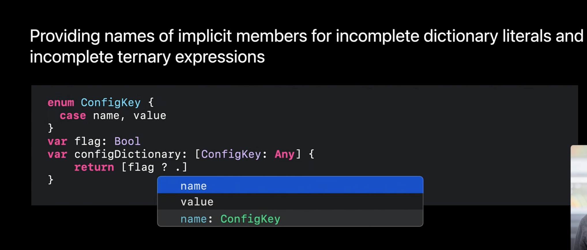
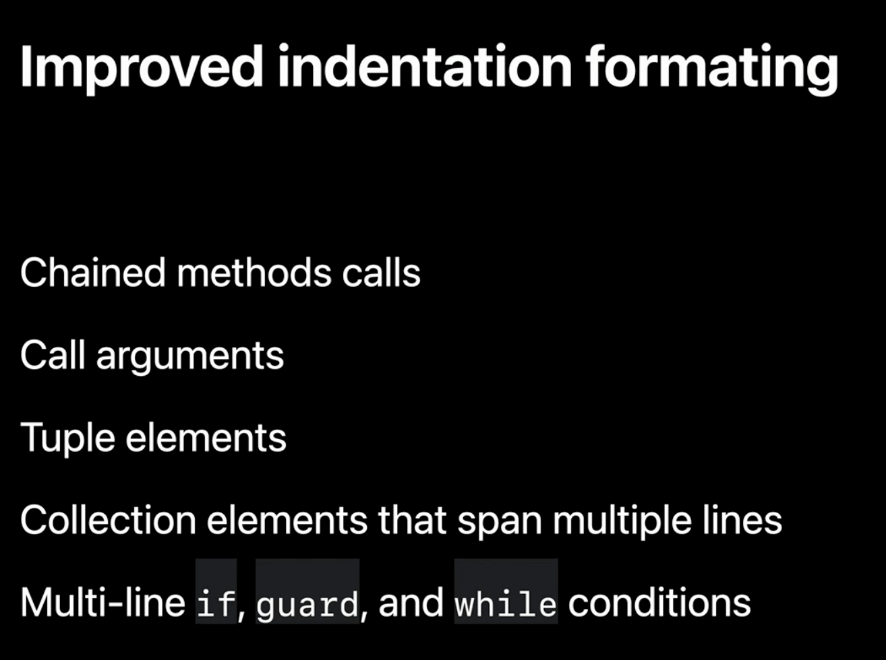
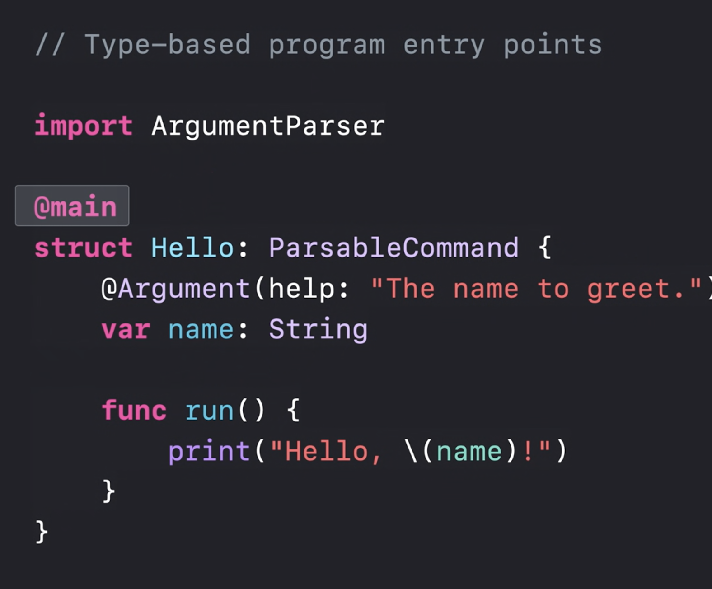

## What's new in Swift](https://developer.apple.com/videos/play/wwdc2020/10170/)

- Swift5에 ABI Stability가 도입되면서 Swift에 바이너리 프레임워크(binary framework)가 도입되었다.
- Xcode 11.4 > Swift 5.2, Xcode 12 > Swift 5.3 지원

### Runtime Performance

#### Code Size

- 바이너리(앱) 사이즈를 굉장히 줄였다. (Objective-C 버젼보다 1.5배 코드사이즈가 작다.

 

- 위의 예시에서 나온 SwiftUI로 만든 오픈소스앱 : https://github.com/Dimillian/MovieSwiftUI

- 위의 예시의 경우 바이너리 사이즈가 43프로만큼 줄었다.

- 바이너리 사이즈는 다운로드 시간에 영향을 미친다.

- 또한 바이너리 사이즈는 앱이 실행 중일 때 `clean memory`ㄹㅏ고 불리는 메모리의 일부이다. 
  
	- clean memory는 쉽게 말해서 필요에 의해서 얼마든지 reload될 수 있는 비울 수 있는 메모리 영역이다.(?)
	- 원문 : But, when you're running the app. it's part of what we call "clean memory." That's memory that can be purged because it can be reloaded when needed.
	
	- clean memory영역은 dirty memory라고 불리는 영역보다 덜 중요하다.(less critical)
	- dirty memory is the memory the application allocates and manipulates at runtime.
	
- dirt memory 영역이 향상되었다.

- Swift의 value type 사용은 reference type based language에 비해 몇가지 근본적인 이점이 있다.
- 아래에서 살펴보자.

#### Dirty Memory

> Objective-C

- 아래와 같이 참조 타입은 참조로 인한 오버헤드가 생겨서 성능과 메모리의 사용에 영향을 준다.
  - (영상에선 어떻게 내부적으로 메모리 이용하는지에 대해 설명해준다.)

- Objective-C에선 객체 변수는 단순히 포인터다. 그래서 Mountain 배열에서 model object에 대한 참조를 갖고 있다. 근데 Mountain객체는 또 자신의 프로퍼티에 대한 참조를 갖고 있다. 이렇게 되다보니 모든 객체에 대한 메모리를 할당해줘야하고 이 때 생기는 performance와 memory use에 대한 오버헤드가 생긴다.
- Objective-C has a special, small string representation for tiny ASCII strings that allow them to be stored within the pointer, which saves on allocating the extra object.

> Swift

- Swift에선 값 타입을 사용하므로 프로퍼티에 대해 포인터로 접근할 필요가 없다.

- 값 타입을 쓸 경우 String의 uuid를 참조하는게 아니라 Mountain안에 직접 값으로 저장을 할 수 있다. 	

- 참조를 하는게 아니라 Mountain이라는 타입안에 직접 넣을 수 있으니깐 참조를 할 필요가 없다. > 메모리 할당을 효율적으로 쓸 수 있다.
- Objective-C와의 차이점
  - Swift's small string can hold many more characters up to 15 code units including non-ASCII characters.

- 아래는 위의 배열에 400개의 모델 객체를 사용할 경우 힙메모리의 사용량 차이를 나타낸다.

  

- 근데 이런 이점에도 불구하고 이전 스위프트 프로그램은 runtime overhead 때문에 여전히 더 많은 heap memory를 사용합니다.

- 이전의 스위프트는 메모리에서 많은 캐시를 만들어내서 오버헤드가 많이 발생했다.
  - 여기서 말한 캐시는 protocol conformances 나 Objective-C와 브릿지하기 위해 사용되는 여러 타입정보들과 데이터들을 저장한다.
- 모든 언어들이 런타임 오버헤드가 있는데, 스위프트의 경우엔 그 오버헤드가 크다.
- 근데 Swift 5.3에선 이 부분이 최적화되었다. 작년에 비해 3분의 1정도로 줄였다.

- 하지만 이 성능 향상을 전부 경험하기 위해선 앱의 minimum deploy target을 iOS 14로 올려야한다...저런..(하지만 이전버젼에 대해서도 어느정도는 성능향상이 있다고 말하고 있다.)

#### Lowering the Swift runtime in the userspace stack

- 대부분 앱에선 이런 메모리 최적화가 크게 안와닿을 수 있지만 중요하다. (Apple system에 있어서)
  - to be able to use it in daemons
  - Memory usage critical for low-level OS Services
- Swift's Standard Library를 스택에서 Foundation아래에 위치시켰다. (Swift lower in system stack than Foundation.)
  -  That means it can actually be used to implement frameworks that will float below the level of Objective-C where previously C had to be used. (Objective-C나 C로 개발했던 프레임워크들의 구현에 사용될 수 있다는 말)

### Developer Experience

#### Diagnositcs

- Errors and warnings from the compiler have vastly improved in this release cycle. 

#### New diagnostics subsystem in the Swift compiler

- 소스코드에서 문제가 생기는 부분을 보다 정확하게 가르킬 수 있도록 해결함.(errors, warnings)

- Swift 5.1에서의 모습(2019년)

- 올해 향상된 diagnostic

- 내부적으로 이런 에러가 난 경우 문제에 대한 더 많은 정보들을 기록하는데 이를 추가적인 메모형태로 제공한다.

- 컴파일러 내부에 있는 새로운 Diagnostic Architecture에 관심이 있다면 다음을 참고하라. [New Diagnostic Architecture](https://swift.org/blog/new-diagnostic-arch-overview/)

#### Code Completion

- code completion inference는 SourceKit안에 있는 컴파일러에 제공된다. (and through the experience in the Xcode code editor.)

- 자동완성의 향샹

  - Improved type-checking inference.
  - 컴파일러가 삼항연산자에서 사용되는 incomplete dictionary literal의 타입을 추론할 수 있다.

  
  - KeyPath as Function ("Keypath as function" surfaces key path expressions as functions that return a type of the keypath.)

  

- 자동완성 15배 빨라짐. SwiftUI코드의 자동완성 기능도 대폭 향상됨.

#### Code Indentation

- (also powered by the open-source SourceKit engine.) 내부적으로 소스킷 엔진을 사용한다.

#### Debugging

- 런타임 오류시 더 정확한 에러 메시지를 보여준다.

#### Increased robustness in debugging

- LLDB에 대한 설명을 많이 했는데 자세히 모르겠음.

####  Swift on AWS Lambda

- open-source : Swift AWS runtime.
- 위의 오픈소스를 통해 AWS Lambda를 사용할 수 있음.

#### Language and Libraries

- Swift Evolution

#### Multiple trailing closure syntax (SE-0279)

- 다중 후행 클로저

- 이전 형태

- 새로운 형태

- SwiftUI에서 아래와 같이 쓸 수 있음

#### API Design

#### KeyPath exrpessions as functions(SE-0249)

- 이해하기 쉬운 코드 : [참고링크](https://medium.com/better-programming/using-key-path-expressions-as-functions-in-swift-f0fe650ef7dc)

#### @main(SE-0281)

- 프로그램의 시작점을 설정할 수 있음.
- 앱델리게이트를 없앨 수 있음.

- https://github.com/apple/swift-evolution/blob/master/proposals/0281-main-attribute.md

- 아래는 과거버젼

- ㅇㅣ번에 변경된 버젼

#### [SE-0269] Increased availability of implicit self in closures

- 만약에 캡쳐리스트 안에 self를 캡쳐했다면 생략할 수 있다.

#### [SE-0276] Multi-pattern catch clauses

- catch에 여러가지 넣을 수 있게 되었음.

 

### Enum Enhancements

- ㅇㅕ러가지 비교를 해야되는경우

위와 같은 경우를 Comparable을 통해 아래와 같이 처리할 수 있음.

-  이제 enum case도 `static var` 나 `static func` 대신 쓸 수 있게되었음.

### 

#### Embedded DSL Enhancemnet

- 

#### Float16

- 16비트 float이 추가됨.

