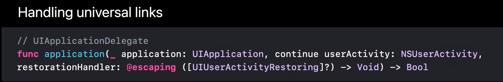
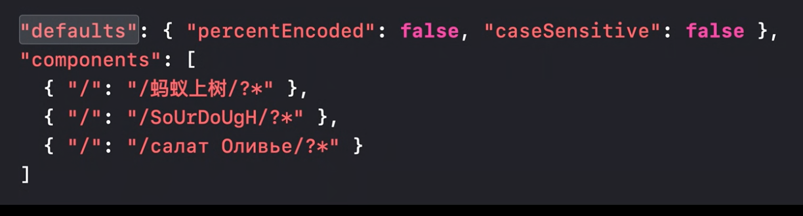

## What's new in Universal Links

- 참고하면 좋은 설명
  - https://juneyr.dev/universal-link

#### Refresh

- 유니버셜 링크는 웹이나 앱에서 콘텐츠를 보여주기 위한 HTTPS, HTTP URLs다.

- 유니버셜 링크는 디폴트 브라우져 대신에 앱내에서 열린다.

- 유니버셜 링크를 만들려면 특별한 entitlement(**Associated Domains entitlement**)를 추가하고.
  - entitlement는 웹서버의 도메인 네임을 기술한다.
  - 웹서버는 app's application identifier를 기술한다.
- JSON file을 웹서버에 추가한다.
- 이렇게 하면 앱과 웹사이트간에 안전한 양방향 연결(?)(association)이 생성되어 앱이 웹 사이트를 대신해서 특별한 태스크를 수행할 수 있다. (This creates a secure two way association between your app and your web site allowing your app to perform special tasks on behalf of your web site.)

- 현재 Custom URL Scheme을 사용하는 곳에 가능하면 빨리 universal link로 마이그레이션을 해야한다. Custom URL 스킴은 추천하지 않는 방법이다.
  - 이 부분에 대해서는 WWDC2019 유니버셜링크를 참고해라.

### New platform support

#### watchOS support

- 이제 watchOS에서 유니버셜링크는 같은 기능을 제공한다. (이전에는 iOS, tvOS, macOS만 됨)
- 특정 플랫폼에 대해서 약간 다른점이 있음.
  - WatchKit API를 사용할 때는 UIKit or AppKit을 사용할 때랑 조금 다르다.

- (**Associated Domains entitlement**가 포함해) entitlements가 WatchKit 앱에 포함되는게 아니라 WatchKit Extension에 적용된다는 점을 기억해라.

- iOS나 Mac Catalyst를 사용해서 유니버셜링크를 처리할 땐 `UIApplicationDelegate`메서드인 `application(_:continue:restorationHandler:)` 를 구현한다.

  

  - (발표자가 여기서 이미 이전 세션에서 이 델리게이트를 어떻게 사용하는지에 대해서 보여줬다고 함.)

- 다른 애플리케이션에서 유니버셜링크를 열 때

  

- watchOS에서는 UIKit대신에 WatchKit을 사용한다. (아래의 메서드를 사용한다.)

  

  - 메서드의 바디(body)는 iOS랑 macOS랑 기본적으로 동일하다.

  - 다른 앱에서 URL을 열고 싶은 경우 `WKExtension`의 `openSystemURL(_:)` 메서드를 사용한다.

- 다른 플랫폼과 마찬가지로 watchOS에서도 앱이 깔려있지 않은 상태에서 유니버셜링크를 열려고 시도하면 실패할 것이다.

- Safari는 watchOS에서 사용 불가능

- 위의 메서드는 value를 리턴하거나 completion handler를 받지 않는다. 그렇기 때문에 wathOS에서 사용자에게 피드백을 남기지 않고 UI를 제공하는 것이 낫다. (이 부분에 대해서는 영상을 통해 시청각 자료를 활용하는 것이 나아보인다.)

  

  

  

  - 애플워치에 앱이 설치되어 있지 않아 유니버셜링크를 열 수 없다고 했을 경우

    

  

- UIKit에서 유니버셜 링크를 다룰 때 (UIScene을 다룰 때 UISceneDelegate가 있다는 것을 주목)

  

  - 결국 유니버셜링크는 어떤 플랫폼을 사용하냐에 따라 조금씩 다르다.

  

- 짜잔. SwiftUI에서 유니버셜링크 지원한다. (자랑하고 싶었던 거)

  

  - SwiftUI를 사용하게 됨으로써 어떤 플랫폼이나 어떤 SDK를 쓰든 상관없어졌다. SwiftUI에 대한 자세한 정보는 What's New in SwiftUI에서 확인할 것.

#### Enhanced pattern-matching

- 일단 어떻게 pattern-maching이 유니버셜링크와 연관되서 동작하는지에 대해 간략하게 설명하자면 wildcards를 구체화하기 위해서 pattern string안에 asterisk와 question mark characters를 사용할 수 있다.

  - How do wildcards work?

    

    - wildcard characters를 사용한 pattern matching에 대한 정보는 작년 영상에서 확인할 수 있다.(What's New in Universal Links on WWDC2019)

- Support for case-insensitive pattern matching

  

  - sourdough의 대소문자를 신경안쓸 수 있는 옵션이 생겼다. (sourDough 등과 같은거 노상관)
  - 이 기능은 macOS catalina 10.15.5, iOS 13.5부터 사용할 수 있다.

#### Unicode

- URL은 항상 ASCII값이다. URL이 non-ASCII(Unicode characters)일 때 실질적으로 percent-encoded characters를 다루게 된다..

- string은 UTF-8로 컨버팅 된 다음 UTF-8 시퀀스의 각 바이트에 대한 16진수 표현이 URL에 배치된다.

  

  - "ants crawling on logs."(중국어) 를 나타낸 거지만 non-ASCII 유니코드 캐릭터여서 위와 같이 percent-encoded가 된 문자열을 보게된다.

- 이제 이를 아래와 같이 지원한다. (위의 문자열이 중국어를 포함하고있다면)

  

  - `percentEncoded`를 false로 = 패턴을 7-bit ASCII charactesr로 매칭시키는게 아니라 **32-bit Unicode code points**로 매치시킨다.
    - Unicode 지원은 macOS Big Sur와 iOS 14이상부터 지원한다...

- `defaults`를 지원한다. 하지만 아래와 같이 명시하게되면 override 된다.

  

  - 아래와 같으면 defaults 옵션 사용

    

  - components를 상속받은 detail

    

  - default지원도 역시 Big Sur와 iOS14부터 지원

#### Pattern matching practice (실제 사례 소개)

- 아래와 같은 URL 사례

- `https://www.example.com/en_US/burrito/`

  - locale code를 포함하고 있음.
  - `burrito`는 product name

- simpel pattern 

  

  - 위와 같이 하게되면 원하는 것보다 더 많은 URL의 패턴매치가 일어날것이다. (만약에 지원하지 않는 국가가 있거나 언어를 지원하지 않거나 한다면?)

  - 그래서 위와 같은 경우에 대한 해결책으로 아래와 같이 하드코딩을 해서 해결할 수 있는 것이 한가지 방법이다.

    

    - 만약에 위와 같이 몇개의 지역과 언어만 있어서 직접 나열한거면 상관이 없는데 100개 이상의 국가에서  아까의 패턴매칭을 쓰면(두글자로된 언어코드, 두글자로된 지역코드 등의 조건) 너무 많은 패턴 매칭이 생겨버린다.

- 이를 위해 나온 것 : **substitution variables**

#### Substitution variables

- These variables appear in your pattern-matching strings and represent any and all of the values you specify.

- They don't recurse.

- 

- 미리 정의된 substituion variables에 대한 설명 (ex: `$(alpha)*` 등)

  

- 활용방법

  

- 예외처리하고 싶으면 "exclude" 옵션도 있음.
- 예제에 관한 이야기... 예외처리, 문법 등

- 지원버젼: iOS 13.5, macOS Catalina 10.15.6

#### Optimizing the first-launch experience

- 앱스토어에서 아이패드에 어떤앱을 다운받았다고하자. 

  - 이 때 시스템은 entitlements(를 체크하고 한개 이상의 apple-app-site-association 파일의 데이터가 필요한지 확인한다.

- 디바이스는 해당 파일을 다운로드 하기 위해서 호스팅되어있는 웹서버에 대한 연결을 연다.

  

- 이제 디바이스가 bandwidth가 제한되어 있고 여러개의 웹서버로부터 여러개의 파일을 다운받는다고 가정해보자. 디바이스는 한번에 조금씩 파일들을 다운로드해야한다.

  

- 다운로드 실패시 다운로드 실패한 파일을 포기하고 다음 파일을 받기위한 웹서버에 다운로드를 시도한다.

- 위에는 이전버젼에 대한 설명입니다.

- 이후 설명되는 영상은 결국 각 웹서버에 연결하는게 아니라**Associated Domains entitlement**를 가지고 Apple CDN에 연결을 하거나 delivery network의 연결을 통해 개선된 사항을 보여주고있습니다.

- CDN의 장점에 대한 설명 (Apple-operated Content Delivery Network)

  

- 하지만 iOS14부터..

- 이후 Alternate modes for internal domains(Default(CDN), Developer mode, Managed mode)에 대해서 나오는데 이해 관한 자세한건 What's New in Managing Apple Devices WWDC20 영상에서 확인.

- 참고 : https://developer.apple.com/documentation/safariservices/supporting_associated_domains

>  그림에 대한 설명이 너무 많아서 영상으로 이해하는게 더 좋을거 같습니다. 15:00 부터 보면 좋을거 같네요.